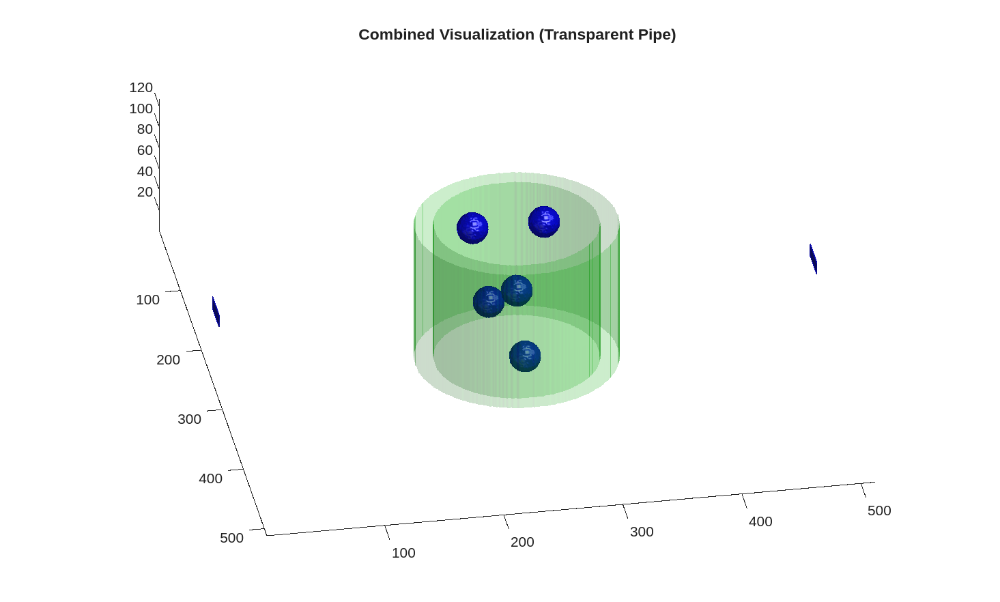

# kwavesource




## Overview

This repository provides a simulation framework using k-Wave to reproduce experimental setups involving ultrasound and fluids. The main goal is to generate high-quality datasets for machine learning applications by numerically simulating ultrasonic wave propagation in complex media, such as pipes and particles in water.

## Getting Started

### Prerequisites

- MATLAB (recommended version: R2020a or later)
- statisitical machine-learing toolbox whic
- [k-Wave Toolbox](https://www.k-wave.org/)
- This repository (clone or download)

### Directory Structure

- `config.json`: Main configuration file for simulation parameters.
- `tutorials/`: Contains example scripts and sample plots.
- `src/`: Source code for simulation and data generation.
- `documents/`: Documentation and images.
- `location_seed/`: Contains seed files for particle/pipe locations.

## Workflow

1. **Generate Pipe and Particle Locations**

   Use `pipe_location_gen.m` to generate seed files specifying the locations of pipes and particles. These files are saved in the `location_seed/` directory.

   ```matlab
   % Example: Generate location seeds
   run('tutorials/pipe_location_gen.m')
   ```

2. **Run Sample Plot and Tutorial Scripts**

   You can visualize and understand the simulation setup using the provided tutorial scripts. For example, `sampleplot.m` and `sandbox.m` in the `tutorials/` directory help you plot the input signals and inspect the simulation domain.

   ```matlab
   % Example: Plot a sample input signal
   run('tutorials/sampleplot.m')
   % Example: Run a sandbox simulation
   run('tutorials/sandbox.m')
   ```

3. **Data Generation**

   The main data generation script reads the configuration and seed files, sets up the simulation domain, and runs the numerical simulation. The results are saved in the specified output directory.

   - The script automatically loads the configuration from `config.json`.
   - It reads the location seed files from the folder specified in the config.
   - Simulation results (e.g., pressure fields, sensor data) are saved for further analysis or machine learning.

   ```matlab
   % Example: Run data generation
   run('src/data_generation.m')
   ```

   Make sure to update the paths in `config.json` if you change the directory structure.

## Notes

- The simulation assumes no net flow due to the short timescale of ultrasonic propagation.
- You can modify the number of particles, pipe dimensions, and other parameters in `config.json`.
- Generated datasets can be used for training and validating machine learning models.

## References

- [k-Wave Documentation](https://www.k-wave.org/documentation/)
- See `documents/` for additional figures and explanations.

## Contact

For questions or contributions, please open an issue or contact the repository maintainer.
